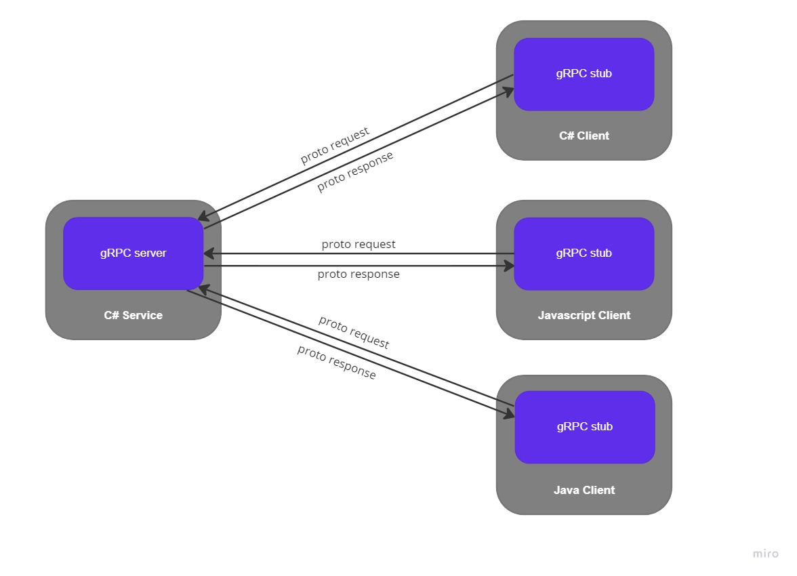
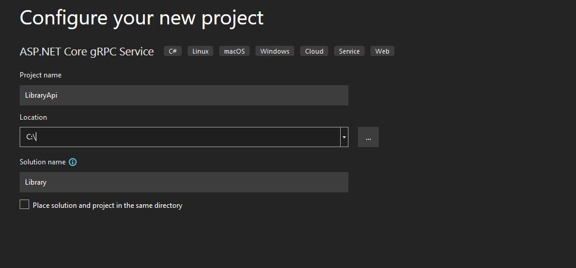
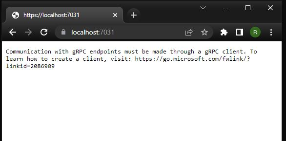

# gRPC : un candidat pour vos futurs projets ? 

## Qu'est-ce c'est ?

**gRPC** Remote Procedure Call (gRPC) est un protocole de communication open source, basé sur des contrats et multiplateforme qui simplifie et gère la communication interservices en exposant un ensemble de fonctions à des clients externes. 


## Protobuf et HTTP/2 au service de la perfomance

Par défaut, gRPC utilise **Protocol Buffers (Protobuf)** un système de sérialisation similaire JSON ou XML. Le système s'appuie sur des fichiers **.proto** qui vont jouer le rôle d'interface et décrire notre objet. Le code source de l'objet pourra ensuite être généré dans plusieurs langages.



Les clients et les serveurs gRPC peuvent ainsi s'exécuter et communiquer entre eux à partir d'environnements différents. Par exemple, un serveur gRPC dans C# peut prendre en charge des clients en JavaScript, Java, C# et tout autre.

De plus, étant conçus pour **HTTP/2**, gRPC permet une communication plus efficace en exploitant les fonctionnalités de streaming bidirectionnel et TLS (transport layer security).

Il est important de noter que gRPC n'est pas le seul à pouvoir utiliser HTTP/2 et profiter de ses améliorations de performance. Les API REST peuvent, elles aussi, se servir d'HTTP/2.

## Mise en pratique : exemple d'implementation

Le plus simple pour explorer son fonctionnement est de se lancer dans un projet pour illustrer son implémentation.

### Creation du projet API

Visual studio 2022 nous fournit un template pour la création d'un service gRPC. Nous allons donc sélectionner **ASP.NET core gRPC Service**, puis nous allons choisir le framework **.NET 6.0 LTS**.

Comme exemple parlant nous allons partir sur un API de gestion de librairie, que nous allons nommer *Library*.




Vous retrouvez maintenant dans notre solution deux fichiers généré par Visual Studio :
- greet.proto : le contrat de notre API
- GreeterService.cs : la classe de service de notre API

#### 1. Création du contrat

Nous allons commencer par définir notre contrat, afin de récupérer les informations d'un livre de notre bibliothèque. En renommant le fichier **greet.proto** en **product.proto**.

Puis définir la fonction pour retourner un produit en passant en entrée son ID de la façon suivante en suivant la documentation suivante de  [proto3](https://developers.google.com/protocol-buffers/docs/proto3) :

```protobuf
syntax = "proto3";

option csharp_namespace = "LibraryAPI";

package book;

service BookCatalog {
    rpc GetBookDetails (BookDetailsRequest) returns (BookDetailsReply);
}

message BookDetailsRequest {
    int32 id = 1;
}

message BookDetailsReply {
    int32 id = 1;
    string name = 2;
    repeated Author author = 4;
}

message Author {
    string firstname = 1;
    string latname = 2;
}
```


#### 2. Création du service

De la même façon nous allons renommer **GreeterService.cs** en **BookService.cs**.

Ensuite, nous réécrivons en dur notre service pour retourner le détail d'un livre en suivant les spécifications du contrat présent dans le fichier **book.proto**, par exemple comme ci-dessous :

```c#
public override Task<BookDetailsReply> GetBookDetails(
                   BookDetailsRequest request, ServerCallContext context)
        {
            var booksDetail = new BookDetailsReply
            {
                Id = request.Id,
                Name = "Element of Reusable Object-Oriented Software"

            };

            var authors = new List<Author>()
            {
                new Author() { Firstname = "Erich",  Lastname = "Gamma"},
                new Author() { Firstname = "Richard",  Lastname = "Helm"},
                new Author() { Firstname = "Ralph",  Lastname = "Johnson"},
                new Author() { Firstname = "John",  Lastname = "Vlissides"},
            };

            booksDetail.Authors.AddRange(authors);

            return Task.FromResult(booksDetail);
        }
    }
```

Pour que le service fonctionne, il nécessaire de modifier le Program.cs pour référencer le nouveau nom du service. Dans notre cas, nous allons renommer ```app.MapGrpcService<GreeterService>(); ``` en ```app.MapGrpcService<BookService>();``` pour rendre notre nouvelle API exécutable.


Maintenant nous pouvons lancer notre projet nous avons bien une API qui tourne. Néamoins si nous essayons d'y accéder depuis un navigateur nous obtenons le message suivant : 




En effet, nous avons besoin d'un client gRPC pour pouvoir établir la communication avec ce nouveau EndPoint.

### Création du client

Pour la création du client vous pouvez partir sur votre langage préféré tel qu'annoncé dans ma présentation. Ici, nous allons partir sur une Console App basique en C# pour appeler notre API, que nous allons appeler LibraryClientApp.

#### 1. Ajout des NuGet
Pour pouvoir fonctionner notre client a besoin des NuGet packages suivant :
- Grpc.Net.Client, contenant le client .NET Core.
- Google.Protobuf, la library protobuf pour C#.
- Grpc.Tools, la boite à outils C# pour les fichiers protobuf

#### 2. Ajout du contrat
Pour rappel, le fonctionnement de gRPC est basé sur le partage de contrat.

Nous allons donc crée un dossier nommé Protos dans lequel nous y copier le **book.proto** depuis notre service.

Puis mettre à jour le namespace du **.proto** avec le namespace de notre projet.
 ```csharp
 option csharp_namespace = "LibraryClientApp";
 ```

Pour que le **.proto** soit bien pris en compte par notre application. Nous devons rajouter un *item group* dans le **.csproj** comme suit : 

```xml
  <ItemGroup>
    <Protobuf Include="Protos\book.proto" GrpcServices="Client" />
  </ItemGroup>
```

### 2. Consommation de l'API

Maintenant que notre contrat est bien enregistré dans notre client. Il nous reste à modifier notre **program.cs** pour accomplir les actions nécessaire à la consommation de notre API: 
- Créez le chanel qui représente l'emplacement du point de terminaison de service (le port peut varier, consultez donc le fichier launchsettings.json, pour la valeur réelle).
- Créer l'objet client.
- Construire une requête simple.
- Envoyer la demande.

```csharp
using System.Text.Json;
using Grpc.Net.Client;
using LibraryApp;

var channel = GrpcChannel.ForAddress("https://localhost:7200");
var client = new BookCatalog.BookCatalogClient(channel);

var request = new BookDetailsRequest
{
    Id = 1
};

var response = await client.GetBookDetailsAsync(request);

Console.WriteLine(JsonSerializer.Serialize(response, new JsonSerializerOptions
{
    WriteIndented = true
}));

Console.ReadKey();
```

Nous pouvons donc maintenant lancer nos deux projets.

En sorti de notre client nous obtenons bien les informations de notre livre : 

```console
{
  "Id": 1,
  "Name": "Element of Reusable Object-Oriented Software",
  "Authors": [
    {
      "Firstname": "Erich",
      "Lastname": "Gamma"
    },
    {
      "Firstname": "Richard",
      "Lastname": "Helm"
    },
    {
      "Firstname": "Ralph",
      "Lastname": "Johnson"
    },
    {
      "Firstname": "John",
      "Lastname": "Vlissides"
    }
  ]
}
```

## Conclusion

Comme nous avons pu le voir, au travers de notre exemple, gRPC offre une prise en main relativement aisé.

gRPC peut convenir parfaitement à un scénario comme un micro-service où l'efficacité est essentielle, car il est conçu pour une faible latence et une communication à débit élevé.

Le dilemme peut poser avec REST, certain point vous amèneront  à choisir l'un ou l'autre. Cependant, dans les deux options conviennent dans beaucoup de cas, au-quels cas je vous encourage à essayer gRPC, cela vous donnera une longueur d'avance sur l'avenir des API.
