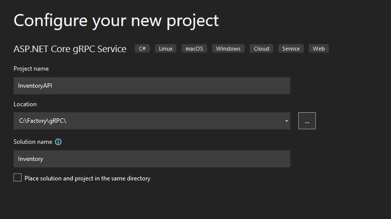

# gRPC : un candidat pour vos futurs projets ? 

## Qu'est-ce c'est ?

**gRPC** Remote Procedure Call (gRPC) est un protocole de communication open source, basé sur des contrats et multiplateforme qui simplifie et gère la communication interservices en exposant un ensemble de fonctions à des clients externes. 

## Protobuf et HTTP/2 au service de la perfomance

Par défaut gRPC utilise **Protocol Buffers (Protobuf)** un système de sérialisation similaire JSON ou XML. Le système s'appuie sur des fichier **.proto** qui vont jouer le rôle d'interface et décrire notre objet. Le code source de l'objet pourra ensuite être générer  dans plusieurs langages.

Les clients et les serveurs gRPC peuvent ainsi s'exécuter et communiquer entre eux à partir d'environnements différents. Par exemple, un serveur gRPC dans C# peut prendre en charge des clients en JavaScript,  Java, C# et tout autre.

De plus etant conçus pour **HTTP/2**, gRPC permet une communication plus  efficace en exploitant les fonctionnalités de streaming bidirectionnel et TLS (transport layer security).

Il est important de noté que gRPC n'est pas le seul a pouvoir utiliser HTTP/2 et profiter de ses améliorations de perfomance. Les API REST peuvent elles aussi se servir d'HTTP/2.

## Mise en pratique : exemple d'implementation

Le plus simple pour explorer son fonctionnement est de se lancer dans un projet pour illustrer son implémentation.

### Creation du projet API

Visual studio 2022 nous fournis un template pour la création d'un service gRPC. Nous allons donc séléctionner **ASP.NET core gRPC Service**, puis nous allons choisir le framework **.NET 6.0 LTS**.

Comme exemple parlant nous allons partir sur un API de gestion de stock, que nous allons nommé *Inventory*.

### 

## Conclusion
-- TODO

gRPC convient parfaitement aux scénarios suivants :

Microservices : gRPC est conçu pour une faible latence et une communication à débit élevé. gRPC est idéal pour les microservices légers où l’efficacité est essentielle.
Communication en temps réel point à point : gRPC offre une excellente prise en charge du streaming bidirectionnel. Les services gRPC peuvent envoyer des messages en temps réel sans interrogation.
Environnements polyglottes : les outils gRPC prennent en charge tous les langages de développement populaires, ce qui fait de gRPC un bon choix pour les environnements multilingues.
Environnements contraintes réseau : les messages gRPC sont sérialisés avec Protobuf, un format de message léger. Un message gRPC est toujours plus petit qu’un message ON équivalent JS.
Communication interprocessus (IPC) : les transports IPC tels que les sockets de domaine Unix et les canaux nommés peuvent être utilisés avec gRPC pour communiquer entre les applications sur le même ordinateur. Pour plus d’informations, consultez Communication interprocessus avec gRPC.

REST et gRPC ont chacun leurs propres cas d'utilisation idéaux en fonction du type de contrat. Cependant, lorsque les deux options conviennent, je vous encourage à essayer gRPC, cela vous donnera une longueur d'avance sur l'avenir des API.